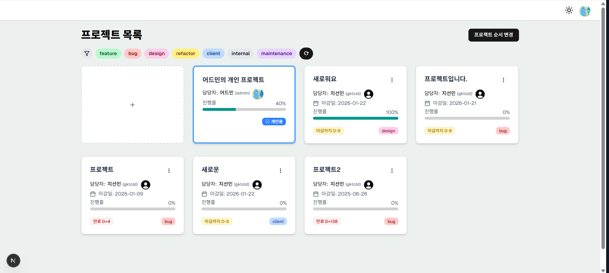
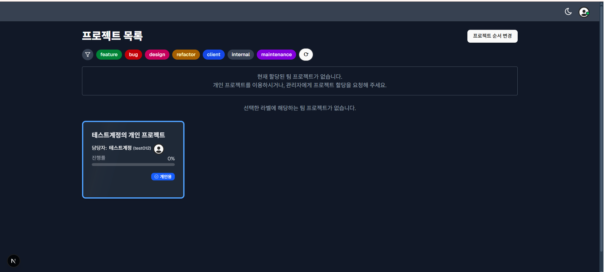
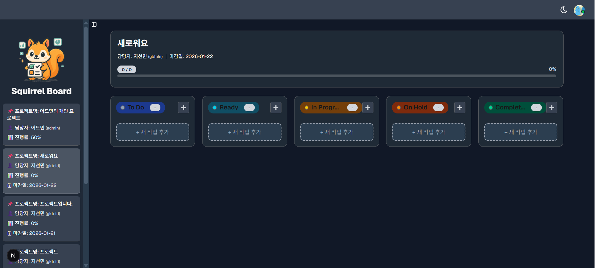
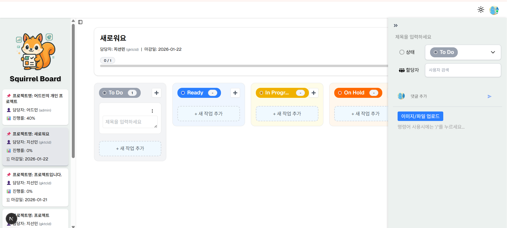
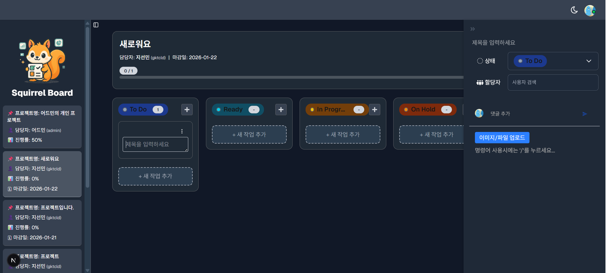
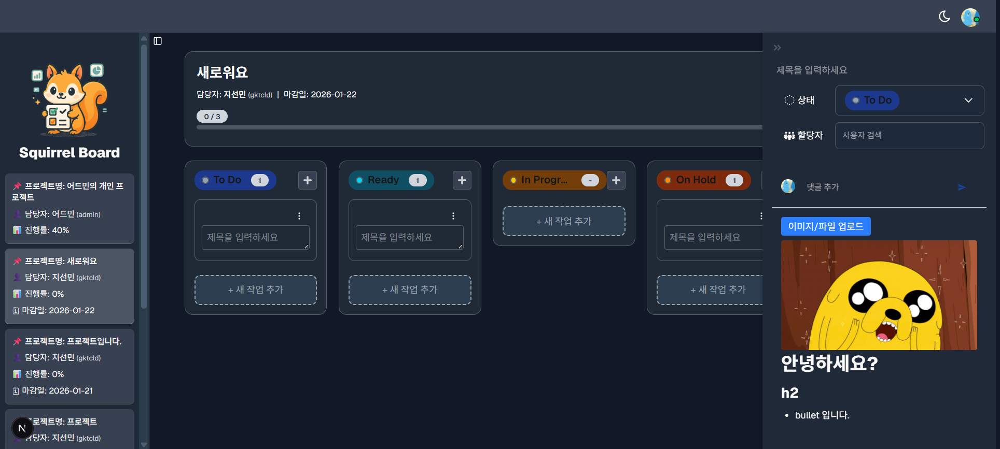
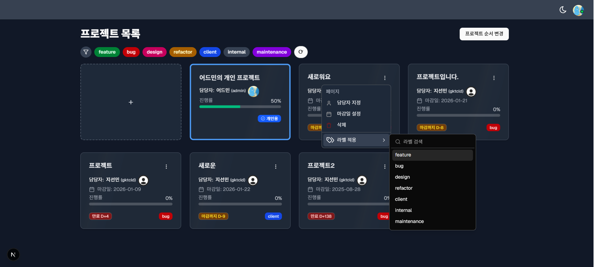
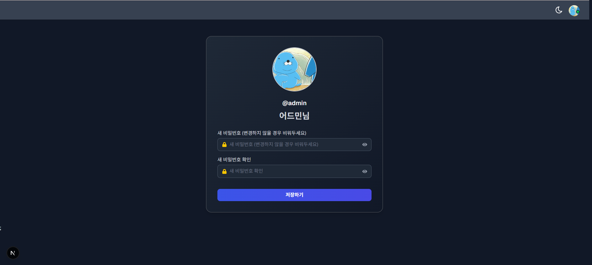

# 🐿️ Squirrel Board

**Squirrel Board**는 프로젝트 단위로 업무(Task)를 관리할 수 있는  
칸반 보드 기반의 **팀 협업용 프로젝트 관리 도구**입니다.  

다크 모드 지원과 직관적인 UI/UX를 중심으로,  
실제 협업 도구에 가까운 사용 경험을 목표로 구현했습니다.

> 🔗 배포 주소: https://task-manager-pink-ten.vercel.app

---

## UI Preview
### 🌗 Project List (Light / Dark)

프로젝트 카드, 태그 필터, 진행률, 마감일(D-day), 담당자 지정 등  
앱의 전체 구조와 디자인 시스템을 한눈에 확인할 수 있는 메인 화면입니다.

| Light Mode | Dark Mode |
|-----------|-----------|
|  |  |

#### ▸ Personal Project

> 가입 시 사용자별 **개인 프로젝트**가 자동 생성되며(개인 작업 공간 용도),  
> 해당 프로젝트는 목록의 첫 번째 카드로 고정되어 순서 변경이 불가능합니다.    
> **마스터 계정**은 전체 프로젝트 조회 권한을 가지지만,  
> **개인 프로젝트(Private)는 권한 범위에서 제외됩니다.**

---

### 🗂️ Kanban Board

Task를 상태별로 관리할 수 있는 칸반 보드 화면입니다.

- 상태 컬럼 기반 Task 관리  
  (`To Do`, `Ready`, `In Progress`, `On Hold`, `Completed`)
- Drag & Drop 기반 상태 변경
- 컬럼 및 카드 단위 상태 시각화
- Task 완료 비율 기반 진행률 표시

> 🔎 실제 동작(GIF)은 [포트폴리오 페이지](https://jisunmin.github.io/)에서 확인할 수 있습니다.

---

### 📝 Task Detail & Side Panel

Task를 클릭하면 우측에서 **사이드 패널 형태의 상세 화면**이 열리며,  
메인 Kanban 보드를 유지한 채 Task의 세부 정보를 관리할 수 있습니다.

#### ▸ Side Panel Opened (Light)

#### ▸ Side Panel Opened (Dark)

사이드 패널에서는 다음과 같은 협업 기능을 제공합니다.

- Task 상태 변경
- 담당자 지정
- 댓글 / 대댓글 작성
- 이미지 / 파일 업로드
- **TipTap Editor 기반** 내용 작성

#### ▸ Editor & Content Management

---

### 🏷️ Project Menu & Label Management

프로젝트 카드 메뉴를 통해 프로젝트 정보를 관리할 수 있습니다.

- 담당자 지정
- 마감일 설정
- 프로젝트 라벨 적용
- 태그 기반 프로젝트 필터링
- 마감일까지 남은 기간을 태그 형태로 표시

---

### 👤 Profile

사용자 프로필 화면에서 비밀번호 변경 및 프로필 이미지 변경이 가능합니다.

---

## 주요 기능 요약

### 프로젝트 관리
- 프로젝트 생성 및 수정  
  (담당자, 마감일, 라벨)
- 하위 Task 완료 비율 기반 진행률 자동 계산
- Drag & Drop 기반 프로젝트 순서 변경
- 라벨(태그) 기반 프로젝트 필터링
- 마감일까지 남은 기간을 D-day 형식(D-0, D-3 등)으로 표시

### Task 관리
- 상태 컬럼 기반 Task 관리  
  (To Do, Ready, In Progress, On Hold, Completed)
- Drag & Drop을 통한 Task 상태 변경
- Task 상세 패널 제공
- TipTap Editor 기반 Markdown 스타일 편집
- 이미지 / 파일 업로드 지원

### 협업 기능
- 댓글 및 대댓글 작성 (1-depth)
- 댓글 내 이미지 / 파일 첨부

### UI / UX
- 다크 모드 / 라이트 모드 지원
- 좌측 프로젝트 목록 및 우측 Task 상세 패널 접기 / 펼치기
- 우측 Task 상세 패널 넓이 조절(리사이즈) 지원
- Optimistic UI 적용
- Skeleton UI 적용
- 반응형 레이아웃

### 인증
- 회원가입 / 로그인
- HttpOnly Cookie 기반 인증
- Zustand 기반 인증 상태 관리

---

## Tech Stack

- Next.js 15 (App Router)
- TypeScript
- Prisma + Supabase
- Supabase Storage
- React Query (TanStack Query)
- Zustand
- React Hook Form
- TipTap Editor
- DND Kit (@dnd-kit/core)
- Tailwind CSS

---

## 🔗 Links

- 🔗 Portfolio (GitHub Pages)
- 📦 Repository
