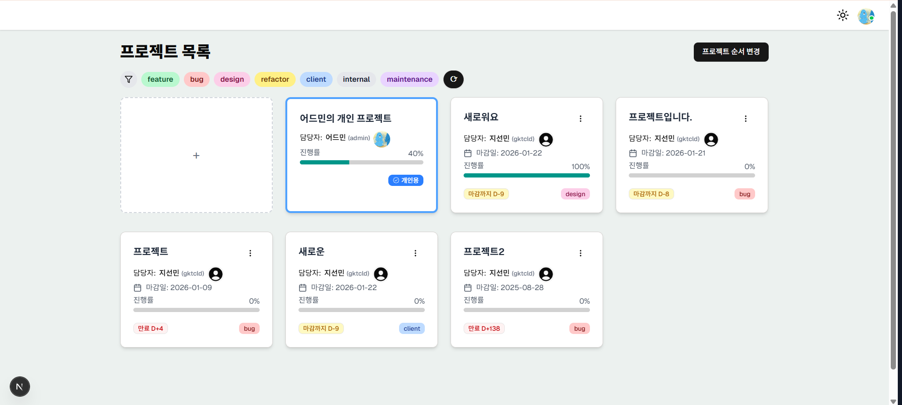
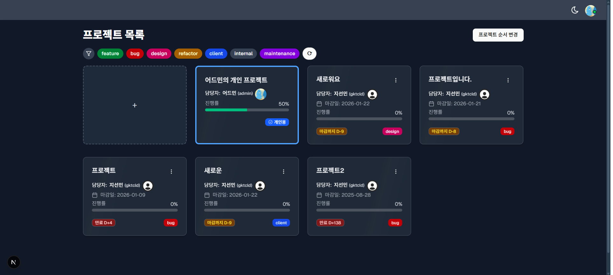
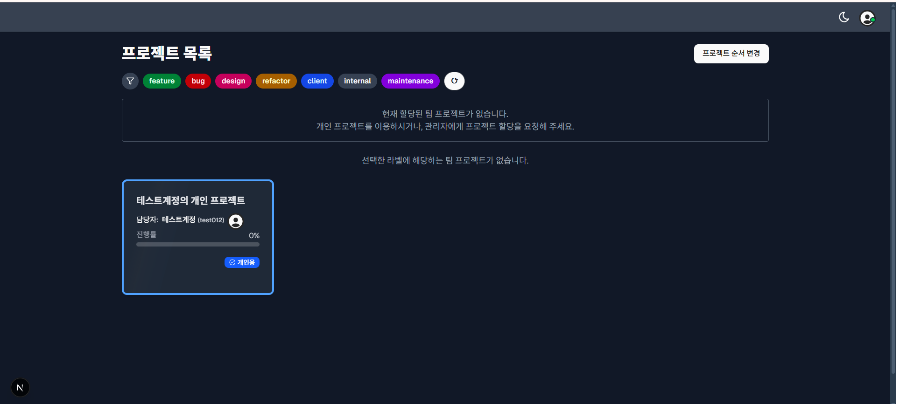
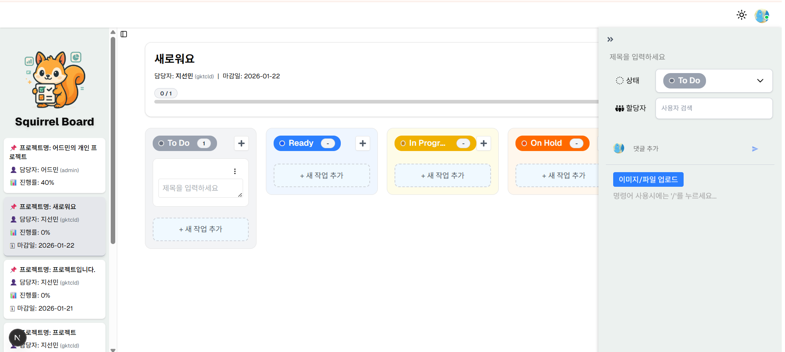
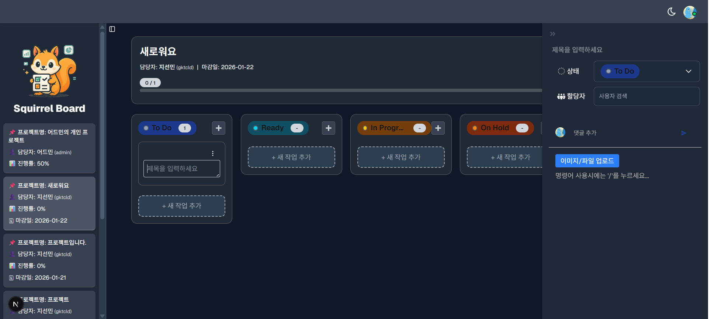
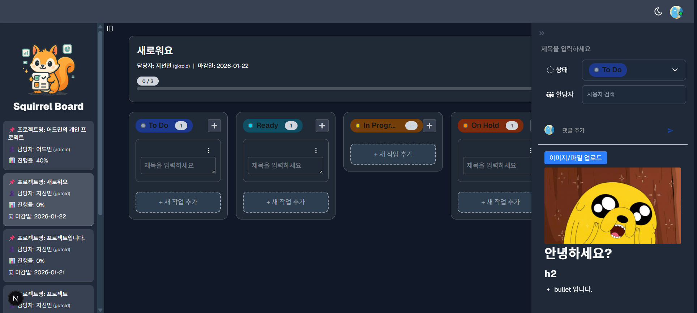
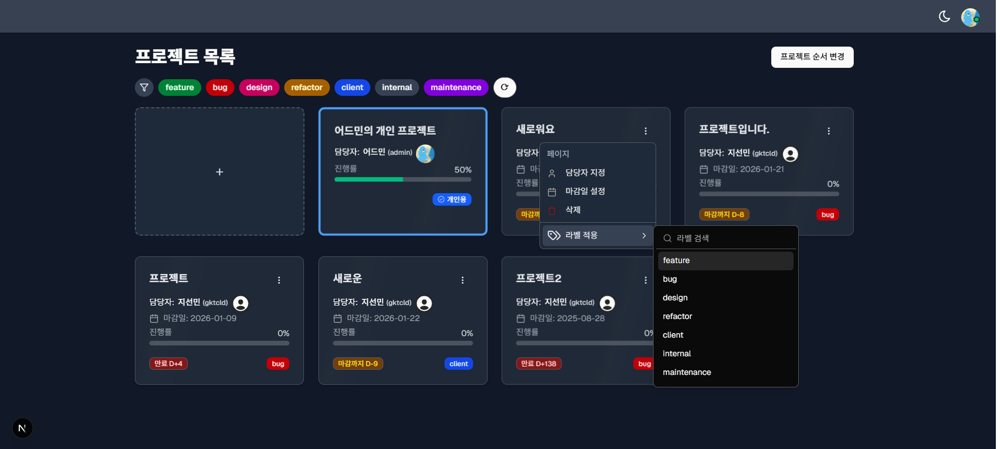
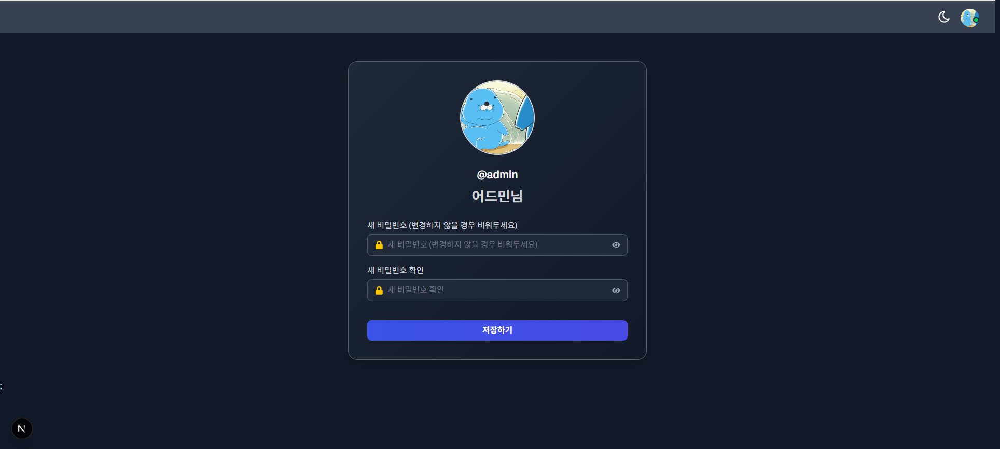

# Squirrel Board

**Squirrel Board**는 프로젝트 단위로 업무(Task)를 관리할 수 있는  
칸반 보드 기반의 **팀 협업형 프로젝트 관리 도구**입니다.  

이 프로젝트는 단순 CRUD 구현보다,  
**실제 사용 흐름에 가까운 협업 UI/UX를 설계하고 구현하는 것**에 초점을 두었습니다.

> 🔗 Live Demo: https://task-manager-pink-ten.vercel.app

---

## Project Summary

- **목표**: 프로젝트 목록, 칸반 보드, 우측 상세 패널을 한 화면 안에서 자연스럽게 연결해 실제 협업 툴에 가까운 사용 경험을 만드는 것
- **중점 구현**: Drag & Drop, 낙관적 업데이트, 인증 분리, 댓글/대댓글, 파일 업로드, 다크 모드, 반응형 레이아웃
- **기술 스택**: Next.js App Router, TypeScript, Prisma, Supabase, React Query, Zustand
- **검증 상태**: `npm run lint`, `npm run build` 통과

---

## Reviewer Guide

### Demo Access

- ID: `testDemo`
- PW: `testDemo123!`
- 로그인 화면에 데모 계정이 기본 입력되어 있어 바로 확인할 수 있습니다.

### What To Look At

- **프로젝트 목록 화면**: 개인 프로젝트/팀 프로젝트 구분, 라벨 필터링, 진행률, 마감일 시각화
- **칸반 보드 화면**: 상태별 Task 관리, Drag & Drop 이동, 진행률 반영
- **우측 상세 패널**: 보드 컨텍스트를 유지한 채 Task 편집, 댓글/대댓글, 파일 업로드, 에디터 사용 가능
- **인증 흐름**: 로그인/회원가입 분리, HttpOnly Cookie 기반 인증 처리

### Local Run

```bash
npm install
npm run seed:demo
npm run dev
```

- `.env`에 `DATABASE_URL`, `DIRECT_URL`, `NEXT_PUBLIC_SUPABASE_URL`, `SUPABASE_SERVICE_ROLE_KEY`가 필요합니다.
- 데모 데이터 시드 후 `http://localhost:3000/auth/login`에서 바로 기능을 확인할 수 있습니다.

### Validation

```bash
npm run lint
npm run build
```

현재 기준으로 린트와 프로덕션 빌드가 모두 통과하도록 정리되어 있습니다.

---

## Design Focus

- 단순히 데이터를 등록/수정/삭제하는 데서 끝나지 않고, **작업 맥락을 잃지 않는 인터페이스**를 만들고자 했습니다.
- 프로젝트 목록, 칸반 보드, 상세 패널을 분리해도 사용자가 화면 전환 없이 계속 작업할 수 있도록 구성했습니다.
- 기능 수보다 **체험 흐름의 자연스러움과 시각적 완성도**를 우선순위에 두고 다듬었습니다.

---

## UI Preview
### Project List (Light / Dark)

프로젝트 카드, 태그 필터, 진행률, 마감일(D-day), 담당자 지정 등  
앱의 전체 구조와 디자인 시스템을 한눈에 확인할 수 있는 메인 화면입니다.

| Light Mode | Dark Mode |
|-----------|-----------|
|  |  |

#### ▸ Personal Project



> 가입 시 사용자별 **개인 프로젝트**가 자동 생성되며(개인 작업 공간 용도),  
> 해당 프로젝트는 목록의 첫 번째 카드로 고정되어 순서 변경이 불가능합니다.    
> **마스터 계정**은 전체 프로젝트 조회 권한을 가지지만,  
> **개인 프로젝트(Private)는 권한 범위에서 제외됩니다.**

---

### Kanban Board

Task를 상태별로 관리할 수 있는 칸반 보드 화면입니다.

- 상태 컬럼 기반 Task 관리  
  (`To Do`, `Ready`, `In Progress`, `On Hold`, `Completed`)
- Drag & Drop 기반 상태 변경
- 컬럼 및 카드 단위 상태 시각화
- Task 완료 비율 기반 진행률 표시

.png)

> 실제 동작 예시는 배포본과 첨부된 스크린샷을 통해 확인할 수 있습니다.

---

### Task Detail & Side Panel

Task를 클릭하면 우측에서 **사이드 패널 형태의 상세 화면**이 열리며,  
메인 Kanban 보드를 유지한 채 Task의 세부 정보를 관리할 수 있습니다.

#### ▸ Side Panel Opened (Light)


#### ▸ Side Panel Opened (Dark)


사이드 패널에서는 다음과 같은 협업 기능을 제공합니다.

- Task 상태 변경
- 담당자 지정
- 댓글 / 대댓글 작성
- 이미지 / 파일 업로드
- **TipTap Editor 기반** 내용 작성

#### ▸ Editor & Content Management



---

### Project Menu & Label Management

프로젝트 카드 메뉴를 통해 프로젝트 정보를 관리할 수 있습니다.

- 담당자 지정
- 마감일 설정
- 프로젝트 라벨 적용
- 태그 기반 프로젝트 필터링
- 마감일까지 남은 기간을 태그 형태로 표시



---

### Profile

사용자 프로필 화면에서 비밀번호 변경 및 프로필 이미지 변경이 가능합니다.



---

## Key Features

### 프로젝트 관리
- 프로젝트 생성 및 수정  
  (담당자, 마감일, 라벨)
- 하위 Task 완료 비율 기반 진행률 자동 계산
- Drag & Drop 기반 프로젝트 순서 변경
- 라벨(태그) 기반 프로젝트 필터링
- 마감일까지 남은 기간을 D-day 형식(D-0, D-3 등)으로 표시

### Task 관리
- 상태 컬럼 기반 Task 관리  
  (To Do, Ready, In Progress, On Hold, Completed)
- Drag & Drop을 통한 Task 상태 변경
- Task 상세 패널 제공
- TipTap Editor 기반 Markdown 스타일 편집
- 이미지 / 파일 업로드 지원

### 협업 기능
- 댓글 및 대댓글 작성 (1-depth)
- 댓글 내 이미지 / 파일 첨부

### UI / UX
- 다크 모드 / 라이트 모드 지원
- 좌측 프로젝트 목록 및 우측 Task 상세 패널 접기 / 펼치기
- 우측 Task 상세 패널 넓이 조절(리사이즈) 지원
- Optimistic UI 적용
- Skeleton UI 적용
- 반응형 레이아웃

### 인증
- 회원가입 / 로그인
- HttpOnly Cookie 기반 인증
- Zustand 기반 인증 상태 관리

---

## Technical Decisions

- **App Router 기반 구조 분리**
  인증/비인증 레이아웃을 분리해 접근 제어와 페이지 구조를 명확히 나눴습니다.
- **React Query + Zustand 역할 분리**
  서버 상태는 React Query, 인증/보드 인터랙션 상태는 Zustand로 관리해 책임을 구분했습니다.
- **상세 패널 중심 편집 흐름**
  Task 상세 화면을 별도 페이지로 분리하지 않고 우측 패널로 구성해 칸반 보드 맥락을 유지했습니다.
- **Drag & Drop + order 기반 정렬**
  상태 이동뿐 아니라 컬럼 내 재정렬을 반영할 수 있도록 order 값을 사용해 정렬 로직을 구성했습니다.
- **데모 계정 및 시드 데이터 제공**
  평가자/면접관이 별도 데이터 세팅 없이 핵심 기능을 바로 확인할 수 있도록 데모 계정과 샘플 데이터를 준비했습니다.

---

## Performance Improvements

- 로그인 성공 직후 프로젝트 목록과 사용자 목록을 prefetch 해 첫 진입 대기 시간을 줄였습니다.
- 프로젝트 카드 hover/click 시 상세 데이터를 prefetch 해 칸반 보드 진입 체감을 개선했습니다.
- React Query `staleTime`과 `refetchOnWindowFocus: false` 설정으로 불필요한 재요청을 줄였습니다.
- 프로젝트/태스크 응답에서 필요한 필드만 `select` 하도록 조정해 payload 크기를 줄였습니다.

---

## Tech Stack

- Next.js 16 (App Router)
- TypeScript
- Prisma + Supabase
- Supabase Storage
- React Query (TanStack Query)
- Zustand
- React Hook Form
- TipTap Editor
- DND Kit (@dnd-kit/core)
- Tailwind CSS

---

## Demo Data

- `testDemo` 관리자 계정과 `demoUser` 일반 계정을 함께 생성합니다.
- 개인 프로젝트와 팀 프로젝트를 모두 포함해 권한에 따른 화면 차이를 확인할 수 있습니다.
- `To Do`, `In Progress`, `Completed` 상태의 샘플 Task와 댓글 데이터가 함께 들어갑니다.

---

## Implementation Notes

- **Frontend**: Next.js App Router 기반으로 인증/비인증 레이아웃을 분리했습니다.
- **State**: React Query로 서버 상태를 관리하고, Zustand로 인증/칸반 UI 상태를 분리했습니다.
- **Backend**: Next.js Route Handler + Prisma 조합으로 인증, 프로젝트, 태스크, 댓글 API를 구성했습니다.
- **Storage**: 첨부 파일과 프로필 이미지는 Supabase Storage를 사용합니다.

---

## Links

- 📦 [Repository](https://github.com/JISUNMIN/task-manager)
